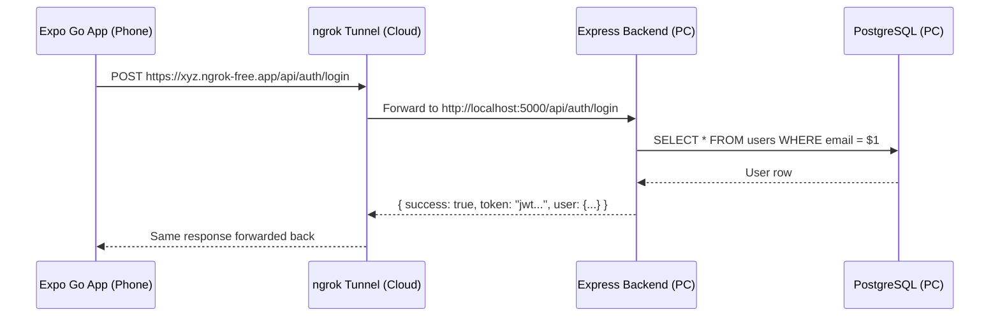

# Production-Ready Backend Overhaul — Walkthrough

## 1. What Changed

### Backend Architecture (Refactored)

```
backend/
├── .env                          # Environment variables
├── server.js                     # Entry point (Helmet, CORS, Rate Limiting)
├── package.json
├── database_schema.sql
└── src/
    ├── config/
    │   ├── db.js                 # PostgreSQL pool (uses env.js)
    │   └── env.js                # Centralized env validation
    ├── controllers/
    │   ├── auth.controller.js    # Register, Login, Forgot Password
    │   ├── pickup.controller.js  # CRUD for pickups
    │   ├── profile.controller.js # Get/Update profile
    │   └── scrap.controller.js   # Scrap requests
    ├── middlewares/
    │   ├── auth.middleware.js     # JWT verification
    │   └── errorMiddleware.js     # Global error handler
    ├── routes/
    │   └── index.js              # All route definitions
    └── utils/
        └── apiResponse.js        # Standardized JSON responses
```

> [!IMPORTANT]
> The redundant root-level `controllers/`, `models/`, `routes/`, `middlewares/`, and `utils/` folders have been **deleted**. All code lives under `src/`.

### Key Improvements

| Area | Before | After |
|---|---|---|
| **Error Handling** | `try/catch` with `console.error` + manual `res.status(500)` in every function | Global `errorMiddleware.js` — all controllers just call `next(err)` |
| **API Responses** | Inconsistent `res.json({ message })` | Standardized `ApiResponse.success()` / `ApiResponse.error()` |
| **Security** | `cors()` wide open, no headers | `helmet()` + `express-rate-limit` (100 req/15min) |
| **JWT Secret** | Hardcoded fallback `'scrap_collector_super_secret_key'` | Validated in `env.js` — server **won't start** without it |
| **DB Config** | `dotenv` called in `db.js` with hardcoded fallbacks | Centralized `env.js` validates all vars at startup |

---

## 2. How to Expose Backend Using ngrok (Updated)

If your Phone and PC are on different networks, follow these steps every day:

### Step 1: Start your Backend
```powershell
cd e:\Scrap_Collector_FV\backend
npm run dev
```
Wait for: `✅ PostgreSQL connected`.

### Step 2: Start ngrok (Open a NEW Terminal)
We recommend using `npx` to avoid "not recognized" errors:

```powershell
# First time only:
npx ngrok config add-authtoken YOUR_AUTH_TOKEN_HERE

# Every day:
npx ngrok http 5000
```

### Step 3: Copy the NEW URL
Look for the line: `Forwarding https://xxxx-xxxx.ngrok-free.app -> http://localhost:5000`.

### Step 4: Update BOTH Expo apps
Open these two files and paste the **new** URL on the `API_URL` line:
1. `Customer/src/lib/api.js`
2. `Collector/src/lib/api.js`

```javascript
// ...
    ngrok: {
        API_URL: "https://your-new-id.ngrok-free.app/api", // 👈 Paste here
    },
// ...
```

> [!WARNING]
> **Free ngrok** generates a NEW URL every time you restart it. You'll need to update `api.js` each time.

---

## 3. Teammate Demo: Quick Start Guide

If you are showing the app to your teammates, follow this **Monday Morning Checklist**:

1.  **PC:** Run `npm run dev` in the backend folder.
2.  **PC:** Run `npx ngrok http 5000`.
3.  **PC:** Update the new URL in `Customer/src/lib/api.js` and `Collector/src/lib/api.js`.
4.  **Phone:** Open the URL in your phone's browser first. Click **"Visit Site"** if a warning appears.
5.  **Phone:** Close and Reopen Expo Go.
6.  **Demo:** Log in fresh to ensure the new token is saved correctly.

---

## 4. Full Data Flow



**In summary:**
1. **Phone** makes HTTPS request to ngrok public URL
2. **ngrok** tunnels it to your PC's `localhost:5000`
3. **Express** processes the request, queries PostgreSQL
4. **Response** flows back through ngrok to the phone

---

## 5. Expo API URL Configuration

Both apps now have a clean environment switcher in `src/lib/api.js`:

```javascript
const ENV = "ngrok"; // 👈 Switch: "ngrok" | "local" | "production"
```

| ENV | When to Use | Example URL |
|---|---|---|
| `"ngrok"` | Phone & PC on **different** networks | `https://abc123.ngrok-free.app/api` |
| `"local"` | Phone & PC on **same** WiFi | `http://192.168.x.x:5000/api` |
| `"production"` | Deployed cloud backend | `https://api.yourapp.com/api` |

---

## 6. Debugging Checklist (Mobile Can't Connect)

If your Expo Go app can't reach the backend, check **in this order**:

| # | Check | Command / Action |
|---|---|---|
| 1 | Is backend running? | `npm run dev` — should say "✅ PostgreSQL connected" |
| 2 | Is PostgreSQL running? | Open pgAdmin or run `psql -U postgres -d scrap_collector` |
| 3 | Is ngrok running? | `ngrok http 5000` — should show Forwarding URL |
| 4 | Is the ngrok URL fresh? | Free plan generates new URL on restart — update `api.js` |
| 5 | Correct URL in `api.js`? | Check `ENVIRONMENTS.ngrok.API_URL` — must end with `/api` |
| 6 | Is `ENV = "ngrok"` set? | Top of `api.js`: `const ENV = "ngrok";` |
| 7 | ngrok browser warning? | First visit in browser → click "Visit Site" to bypass warning |
| 8 | Firewall blocking? | Temporarily disable Windows Firewall for port 5000 |
| 9 | Restart Expo Go | Close and reopen the app — Metro caches old code |
| 10 | Check ngrok dashboard | Visit `http://127.0.0.1:4040` to see real-time request logs |

> [!TIP]
> The **ngrok inspector** at `http://127.0.0.1:4040` is your best debugging tool. It shows every request, response body, and status code in real time.

---

## 7. Scaling Suggestions for Real Users

| Priority | Improvement | Why |
|---|---|---|
| 🔴 Critical | **Deploy PostgreSQL** to a managed service (Supabase, Neon, AWS RDS) | Local DB = data loss risk, single point of failure |
| 🔴 Critical | **Deploy backend** to Railway / Render / Fly.io | Replace ngrok with a real production URL |
| 🔴 Critical | **Change JWT_SECRET** to a strong random string (32+ chars) | Current secret is guessable |
| 🟡 Important | **Use DB transactions** for wallet balance updates in `updatePickupStatus` | Prevents partial writes if one query fails |
| 🟡 Important | **Add input validation** library (e.g., `zod` or `joi`) | Stronger validation than manual `if` checks |
| 🟡 Important | **Add request logging** (e.g., `morgan`) | Production visibility into API usage |
| 🟢 Nice to have | **Add pagination** to list endpoints (`/pickups/all`, `/scrap/my`) | Performance at scale |
| 🟢 Nice to have | **Add Swagger/OpenAPI** docs | Self-documenting API for your team |
| 🟢 Nice to have | **WebSocket** for real-time pickup status updates | Better UX than polling |

---

## 8. Multi-Collector Architecture

The backend now fully supports multiple collectors concurrently using a **Zero-Frontend-Change** locking mechanism.

### How it Works
1. **Visibility:** When a collector visits the Dashboard, `getTodayPickups` SQL queries for `collector_id IS NULL OR collector_id = <my_id>`. This means they only see **brand new** requests and requests **they already own**.
2. **Claiming/Locking:** When a collector clicks a pickup to change its status to "In Progress" or "Completed", the backend checks who owns it first.
    - If it's owned by `NULL` (brand new), it assigns it to them (`collector_id = auth.user_id`).
    - If it's owned by them, it updates the status.
3. **Race Condition Prevention:** If Collector A and Collector B both see a new pickup and click it at the same exact time, the first request to hit the database claims it. The second request is rejected with a **403 Forbidden** ("Another collector has already claimed this pickup").

This allows you to add infinite collectors to the system without changing any UI code in the Collector app!

---

## Files Modified

| File | Change |
|---|---|
| [server.js](file:///e:/Scrap_Collector_FV/backend/server.js) | Added Helmet, Rate Limiting, CORS config, Error middleware |
| [env.js](file:///e:/Scrap_Collector_FV/backend/src/config/env.js) | **[NEW]** Centralized env validation |
| [db.js](file:///e:/Scrap_Collector_FV/backend/src/config/db.js) | Uses centralized env, supports DATABASE_URL |
| [apiResponse.js](file:///e:/Scrap_Collector_FV/backend/src/utils/apiResponse.js) | **[NEW]** Standardized API response utility |
| [errorMiddleware.js](file:///e:/Scrap_Collector_FV/backend/src/middlewares/errorMiddleware.js) | **[NEW]** Global error handler |
| [auth.middleware.js](file:///e:/Scrap_Collector_FV/backend/src/middlewares/auth.middleware.js) | Uses env.JWT_SECRET, delegates errors to middleware |
| [auth.controller.js](file:///e:/Scrap_Collector_FV/backend/src/controllers/auth.controller.js) | ApiResponse + next(err) |
| [pickup.controller.js](file:///e:/Scrap_Collector_FV/backend/src/controllers/pickup.controller.js) | ApiResponse + next(err) + **Multi-collector locking & visibility logic** |
| [profile.controller.js](file:///e:/Scrap_Collector_FV/backend/src/controllers/profile.controller.js) | ApiResponse + next(err) |
| [scrap.controller.js](file:///e:/Scrap_Collector_FV/backend/src/controllers/scrap.controller.js) | ApiResponse + next(err) |
| [Customer api.js](file:///e:/Scrap_Collector_FV/Customer/src/lib/api.js) | Environment-aware URL config (ngrok/local/production) + ApiResponse data unwrap fix |
| [Collector api.js](file:///e:/Scrap_Collector_FV/Collector/src/lib/api.js) | Same environment-aware URL config + ApiResponse data unwrap fix |
| [Customer AuthContext.js](file:///e:/Scrap_Collector_FV/Customer/context/AuthContext.js) | Corrupted token auto-clear logic |
| [Collector AuthContext.js](file:///e:/Scrap_Collector_FV/Collector/context/AuthContext.js) | Corrupted token auto-clear logic |
| [.env](file:///e:/Scrap_Collector_FV/backend/.env) | Added NODE_ENV |
